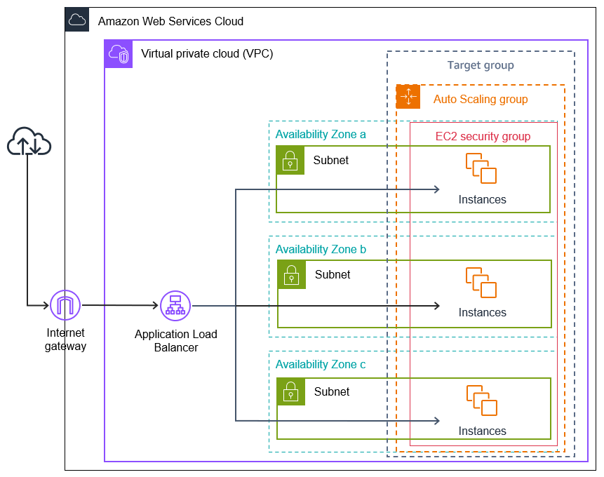

## AWS Auto Scaling Web App  (CloudFormation – Free Tier Safe)

Project Overview

This project deploys a highly available web application on AWS using Infrastructure as Code (IaC) with CloudFormation.

It provisions:

- EC2 Launch Template  
- Auto Scaling Group (Min: 1, Max: 3, Desired: 3)  
- Application Load Balancer (ALB)  
- Target Group & Listener  
- CloudWatch Log Group  
- CloudWatch CPU Alarm  
- SNS Email Notification  

Route53 is intentionally not used to keep it Free Tier safe.

---

##  Architecture Flow

<p align="center">
  
</p>

Client → Application Load Balancer → Target Group → Auto Scaling Group → EC2 Instances  
CloudWatch → SNS → Email Alerts  

---

##  Services Used

- Amazon EC2  
- Auto Scaling  
- Application Load Balancer  
- CloudWatch  
- SNS  
- CloudFormation (YAML)

---

##  How It Works

### 1️⃣ Launch Template
- Uses Amazon Linux AMI  
- Installs Apache (`httpd`)  
- Deploys a styled HTML page  
- Displays:
  - Hostname  
  - Instance IP  

### 2️⃣ Auto Scaling Group
- Minimum: 1 instance  
- Maximum: 3 instances  
- Desired Capacity: 3  
- Deployed across 3 subnets (Multi-AZ)

### 3️⃣ Application Load Balancer
- Listens on HTTP (Port 80)  
- Distributes traffic to healthy EC2 instances  

### 4️⃣ CloudWatch Alarm
- Monitors CPU Utilization  
- Triggers when CPU ≥ 2%  
- Sends alert to SNS Topic  

### 5️⃣ SNS Email Alert
- Sends notification to configured email  
- Requires email confirmation after deployment  

---

#  How to Deploy This Stack

## Step 1: Login to AWS Console

Go to:

AWS Console → CloudFormation  

---

## Step 2: Create Stack

1. Click **Create Stack**  
2. Choose **Upload a template file**  
3. Upload your `template.yaml`  
4. Click **Next**

---

## Step 3: Configure Stack

- Stack Name: `webapp-asg-demo`  
- Keep default parameters:
  - AMI ID  
  - Instance Type (`t3.micro` – Free Tier eligible)

Click **Next → Next → Create Stack**

---


#  How to Access the Web App

1. Go to:

EC2 → Load Balancers  

2. Copy the **DNS Name** of the Application Load Balancer  

3. Open in browser:

```
http://<ALB-DNS>
```

You should see:

✔ Web App Running  
✔ Hostname  
✔ Instance IP  

Refresh multiple times to see load balancing across instances.

---

#  Free Tier Safety Notes

- Uses `t3.micro`  
- No Route53  
- No NAT Gateway  
- No RDS  
- 1-day CloudWatch log retention  

Always delete stack after testing to avoid charges.

---

# Cleanup (Very Important)

Go to:

CloudFormation → Stacks → Delete Stack  

This removes:
- EC2 instances  
- Load balancer  
- Target group  
- Alarm  
- SNS topic  
- Log group  

Never forget cleanup.

---

# What This Project Demonstrates

- Infrastructure as Code  
- High Availability Architecture  
- Load Balancing  
- Auto Scaling  
- Monitoring & Alerting  
- Multi-AZ Deployment  

This is a production-style scalable AWS setup built entirely using CloudFormation.
